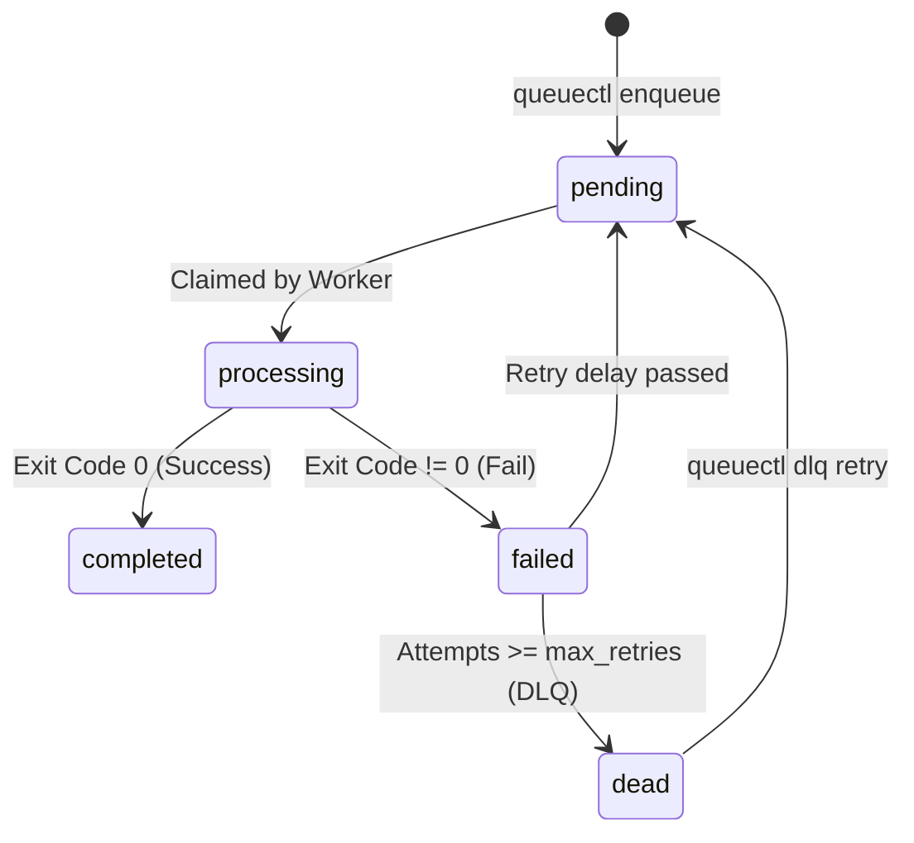

# QueueCTL - CLI & Web Background Job Queue System

## 🚀 Deployed Live Links
### 🌐 [Click Here: Live Web Console Dashboard (Vercel)](https://queuectl-jet.vercel.app/)
### ⚙️ [Click Here: Live Backend API Metrics (Render)](https://queuectl-4ikx.onrender.com/api/dashboard/stats)

QueueCTL is a minimal, production-grade, background job queue system built using **Java 24**, **Spring Boot 3**, **PostgreSQL**, **Picocli**, and **ThreadPoolExecutor**. 

This system manages background jobs, processes them using multiple worker threads, handles automatic retries with exponential backoff, maintains a Dead Letter Queue (DLQ) for permanently failed jobs, and features a glowing dark-theme web dashboard.

---

## 🚀 Key Highlights

- **Fast & Lightweight CLI**: Built with Picocli; launches with no web overhead for standard commands (Tomcat web server is bypassed).
- **Database Row-Level Locking**: Leverages PostgreSQL's native `FOR UPDATE SKIP LOCKED` for race-free parallel processing.
- **Auto-Healing Orphan Cleanup**: Automatically detects dead workers using heartbeats and reschedules orphaned jobs.
- **Cooperative Graceful Shutdown**: Terminates worker threads cleanly, ensuring active jobs complete before shutdown.
- **Premium Web Dashboard**: A single-page, real-time UI built with glassmorphism styling, live statistics, auto-refresh toggles, configuration updates, and a green monospace log reader.
- **Auto-Created Databases**: Automatically connects, checks for, and provisions PostgreSQL database catalogs and schemas at startup.

---

## 🛠️ Tech Stack & Requirements
- **Java SE Development Kit**: Version 24+
- **Apache Maven**: Version 3.9+
- **Database**: PostgreSQL (for production/CLI), H2 (for isolated test builds)

---

## 📁 Project Structure

```text
queuectl/
├── src/
│   ├── main/
│   │   ├── java/com/queuectl/
│   │   │   ├── QueueCtlApplication.java    # Application Entry point
│   │   │   ├── cli/                        # Picocli Commands & Subcommands
│   │   │   ├── model/                      # JPA Entities (Job, Worker, Config)
│   │   │   ├── repository/                 # Database Query & Row Locking Interfaces
│   │   │   ├── service/                    # Business Logic, Worker loop & Orphan Checkers
│   │   │   └── controller/                 # REST APIs for Web UI Console
│   │   └── resources/
│   │       ├── application.properties      # Database & Server settings
│   │       └── static/index.html           # Dark-Theme HTML/CSS/JS Dashboard
│   └── test/
│       ├── java/com/queuectl/
│       │   └── QueueCtlApplicationTests.java # Core Integration Test Suite
│       └── resources/
│           └── application.properties      # Test database configs (H2)
├── pom.xml                                 # Maven dependencies
├── queuectl.bat                            # Windows Command Wrapper
└── queuectl                                # Unix Shell Command Wrapper
```

---

## 🏗️ Architecture & Core Logic

### 1. Job Lifecycle States


### 2. Multi-Worker Concurrency & Database Locking
To prevent duplicate job execution when multiple workers query the database in parallel, QueueCTL uses **transaction-level row locking**:
```sql
SELECT * FROM jobs 
WHERE (state = 'pending' AND run_at <= NOW()) 
   OR (state = 'failed' AND attempts < max_retries AND run_at <= NOW()) 
ORDER BY priority DESC, created_at ASC 
LIMIT 1 FOR UPDATE SKIP LOCKED
```
Each thread in the worker pool claims a job by executing this query inside a transaction, updating the status to `processing`, and committing immediately. The database locks the row and skips it for other threads, ensuring **zero overlap** with maximum throughput.

### 3. Heartbeats & Auto-Healing
Worker processes register themselves in a `workers` table with their Process ID (PID).
- A background heartbeat thread updates `last_heartbeat` every 2 seconds.
- Every 1 second, the system scans for dead workers (no heartbeat for 10+ seconds).
- Any job marked `processing` by a dead worker is automatically rescheduled to `failed` or `dead` (DLQ) so that it is never permanently stuck.

### 4. Graceful Shutdown
When `queuectl worker stop` is executed:
- All active worker states in the database are set to `STOPPING`.
- Running worker instances check this status, stop polling for new jobs, shutdown the `ThreadPoolExecutor`, wait for active jobs to complete (up to 60 seconds), mark themselves `STOPPED`, and terminate.

---

## 📦 Build & Installation

1. **Clone and Navigate**:
   ```bash
   cd queuectl
   ```
2. **Compile and Package**:
   ```bash
   mvn clean package
   ```
   This generates a runnable fat JAR at `target/queuectl-1.0.0.jar`.

---

## ⚙️ Configuration & Database Setup

QueueCTL defaults to connecting to PostgreSQL on `localhost:5432` with username `postgres` and password `postgres`.
- At startup, the app automatically checks if the `queuectl` database exists and runs `CREATE DATABASE queuectl` if missing.
- You can override the credentials using standard environment variables:
  ```bash
  # Windows PowerShell
  $env:DB_URL="jdbc:postgresql://localhost:5432/my_db"
  $env:DB_USER="my_user"
  $env:DB_PASSWORD="my_password"

  # Unix
  export DB_URL="jdbc:postgresql://localhost:5432/my_db"
  export DB_USER="my_user"
  export DB_PASSWORD="my_password"
  ```

---

## 💻 CLI Commands & Usage Examples

You can run commands using the `queuectl.bat` wrapper (Windows) or the `./queuectl` shell script (Unix).

### 1. Enqueue Job
Add a job to the queue by passing a JSON string containing the command:
```bash
queuectl enqueue "{\"id\":\"job-1\",\"command\":\"echo 'Hello world'\",\"priority\":5,\"maxRetries\":3}"
```
*Output:*
```text
Job enqueued successfully. ID: job-1 [State: pending]
```

### 2. Start Workers
Start background worker processes:
```bash
queuectl worker start --count 3
```
*Output:*
```text
Started worker process in background with 3 threads. PID: 12344
Worker logs written to worker.log and worker-error.log
```

### 3. Stop Workers Gracefully
Request all active background workers to stop processing and exit:
```bash
queuectl worker stop
```
*Output:*
```text
Sending shutdown signal to all running worker processes...
Shutdown command recorded. Active workers will terminate gracefully after completing current tasks.
```

### 4. Check Queue Status
Show active worker statistics and job states summary:
```bash
queuectl status
```
*Output:*
```text
========================================
       QueueCTL Status Summary
========================================
Total Jobs Enqueued:  5
----------------------------------------
  Pending:            1
  Processing:         0
  Completed:          3
  Failed:             0
  Dead (DLQ):         1
----------------------------------------
Success Rate:         75.00%
Avg Exec Duration:    1200 ms
Active JVM Workers:   1
========================================
```

### 5. List Jobs by State
Filter and display jobs inside the database:
```bash
queuectl list --state completed
```
*Output:*
```text
=================================================================================
   Jobs with State: completed (3 found)
=================================================================================
Job ID                               | State      | Prio | Retries | Command             
---------------------------------------------------------------------------------
job-1                                | completed  | 5    | 1/3     | echo 'Hello world'  
job-2                                | completed  | 0    | 1/3     | ping -n 2 127.0.... 
=================================================================================
```

### 6. Manage Dead Letter Queue (DLQ)
List or retry failed jobs:
```bash
# List DLQ
queuectl dlq list

# Retry a specific DLQ job
queuectl dlq retry job-1
```
*Output:*
```text
Success: Job job-1 has been reset and moved back to pending queue.
```

### 7. Update Configurations Dynamically
Modify queue variables:
```bash
queuectl config set max-retries 5
queuectl config set backoff-base 3
```
*Output:*
```text
Configuration updated: max-retries = 5
```

### 8. Launch Web Dashboard Console
Start the Spring Boot Tomcat container to host the graphical monitoring console:
```bash
queuectl dashboard
```
*Output:*
```text
=================================================
   QueueCTL Monitoring Web Dashboard Started
=================================================
Web Console is listening on: http://localhost:8080/
Press Ctrl+C to stop the dashboard server.
=================================================
```
Open [http://localhost:8080/](http://localhost:8080/) in your web browser to access the interactive dark-mode dashboard console!

---

## 🧪 Testing Instructions

An isolated integration test suite is located in `QueueCtlApplicationTests.java`. The test suite automatically launches an in-memory H2 database, eliminating the need to set up PostgreSQL credentials for testing.

To execute tests, run:
```bash
mvn clean test
```
*Tests verify:*
1. **Basic Job Success**: An `echo` command executes, records output, and sets state to `completed`.
2. **Exponential Backoff & DLQ**: A failing command retries and is quarantined in the DLQ when attempts exceed limits.
3. **Graceful Shutdown**: The worker shuts down and finishes current tasks when cooperative flags change.
4. **Concurrency & Locking**: Multiple parallel threads pick up jobs independently without overlap or duplicate processing.
5. **Auto-Healing**: Dead workers are recognized and orphaned jobs are rescheduled.
